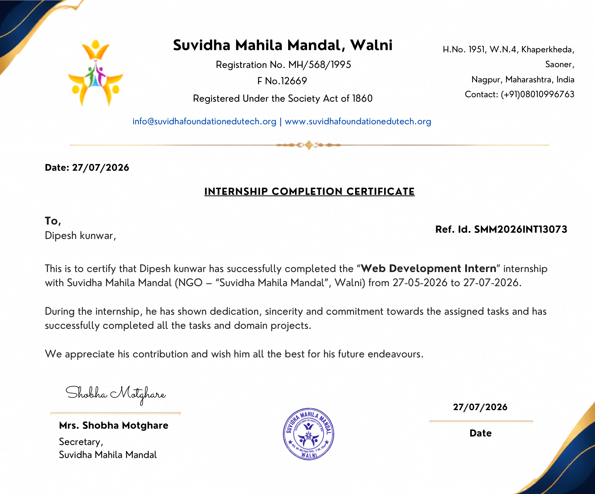
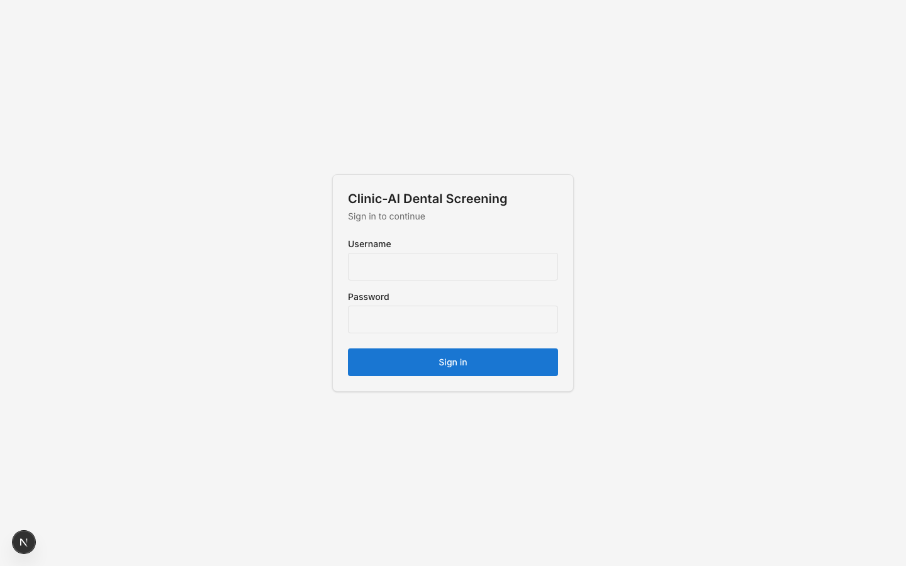
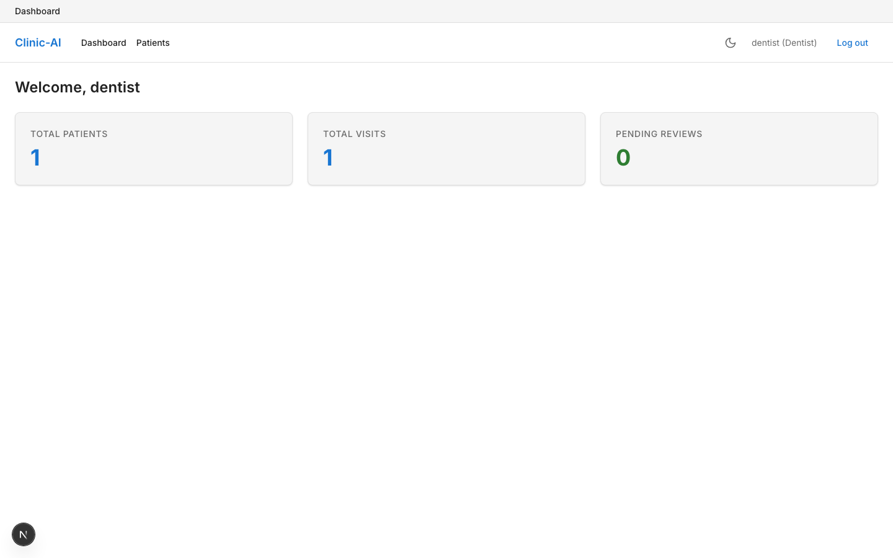
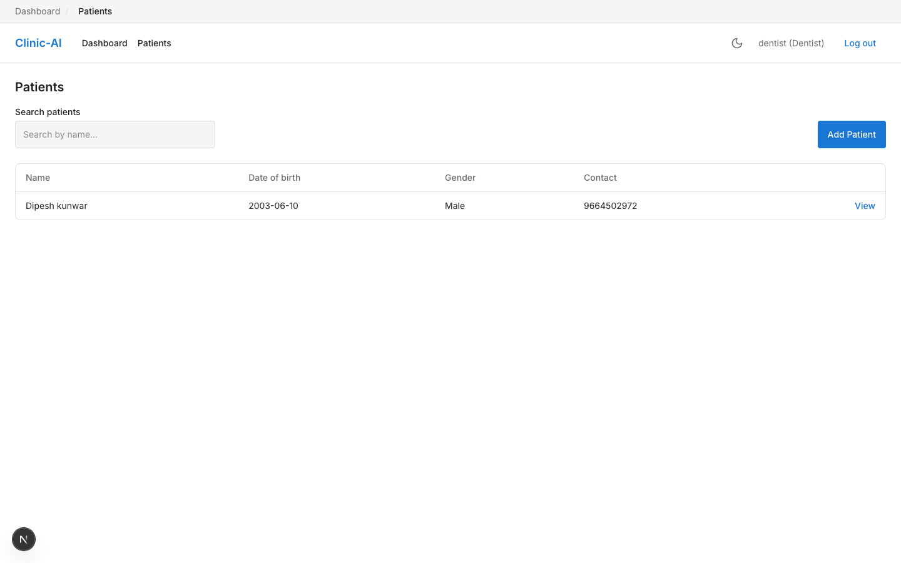
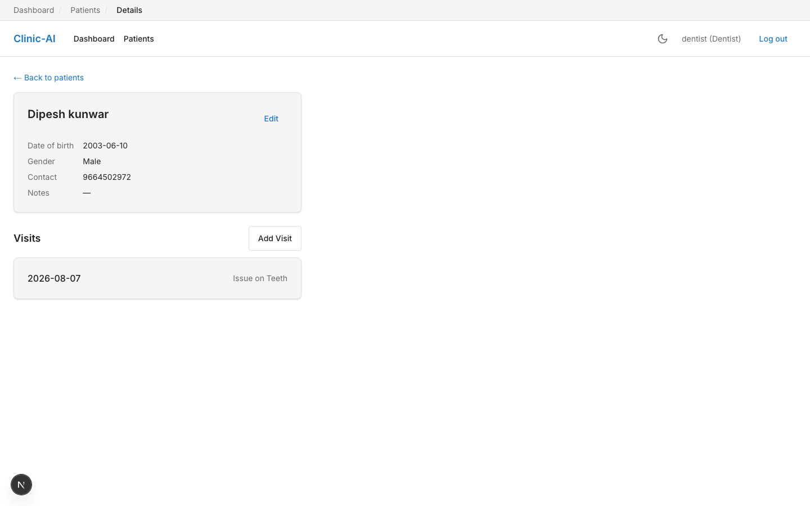
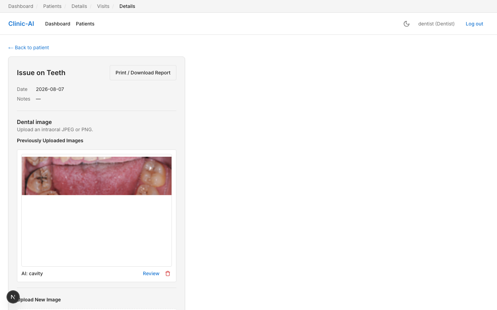
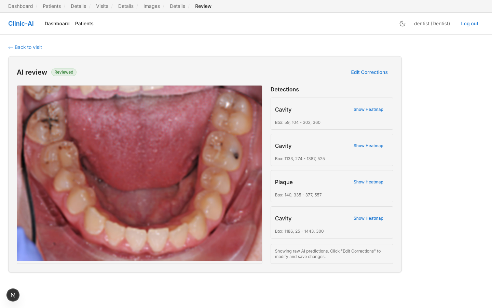
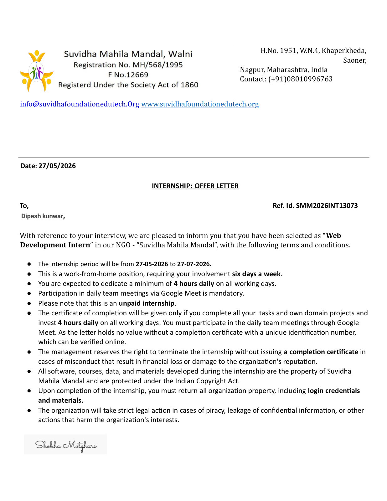

\newpage

# CLINIC-SPECIFIC AI DENTAL SCREENING

## An AI-Assisted Dental Disease Detection and Clinic Management System

**A Final Internship Report Submitted in Partial Fulfilment of the Requirements of the**
**Web Development Internship Programme**

&nbsp;

**Submitted by:**
Dipesh Kunwar

**College:** Pandit Deendayal Energy University
**Department:** Computer Science & Engineering
**Academic Year:** 2023–2027

**Internship Organization:** Suvidha Mahila Mandal, Walni (Suvidha Foundation)
**Reference ID:** SMM2026INT13073
**Internship Duration:** 27 May 2026 – 27 July 2026 (Web Development Intern)

\newpage

# CERTIFICATE

*(Internship Completion Certificate issued by Suvidha Mahila Mandal, Walni — Ref. ID SMM2026INT13073, dated 27/07/2026)*

\newpage

# ACKNOWLEDGEMENT

I would like to express my sincere gratitude to **Suvidha Mahila Mandal, Walni** (Suvidha Foundation) for granting me the opportunity to undertake the "Web Development Intern" internship from 27 May 2026 to 27 July 2026. I am especially thankful to **Mrs. Shobha Motghare, Secretary, Suvidha Mahila Mandal**, for her guidance, supervision, and continuous encouragement throughout the internship period.

I also wish to thank **[Internal Guide / HOD name to be inserted]**, Department of Computer Science & Engineering, Pandit Deendayal Energy University, for their academic supervision, valuable suggestions, and support in aligning this internship with my coursework requirements.

I am grateful to my family, peers, and the daily stand-up team at Suvidha Mahila Mandal for their support during the six-day-a-week, work-from-home internship schedule. Finally, I acknowledge the open-source community and the maintainers of the frameworks and libraries — Next.js, FastAPI, MongoDB, Ultralytics YOLOv8, and others — whose tools made this project possible.

**Dipesh Kunwar**

\newpage

# ABSTRACT

This report documents the work completed during a two-month (27 May 2026 – 27 July 2026), unpaid, work-from-home "Web Development Intern" internship at Suvidha Mahila Mandal, Walni (registered NGO, Suvidha Foundation), during which the intern independently designed, built, and deployed a full-stack, AI-assisted dental screening and clinic-management web application titled **Clinic-Specific AI Dental Screening**.

The system allows clinic staff (dentists, receptionists, and administrators) to register patients, record visits, upload intraoral photographs, and receive automated disease-detection predictions — cavity, plaque, and gingivitis — generated by a fine-tuned YOLOv8n object-detection model. Dentists review, correct, and approve AI predictions through a purpose-built review interface, after which a downloadable PDF summary report can be generated per visit. The application also incorporates an experimental Grad-CAM-based explainability pipeline to visualize the image regions influencing a prediction.

The system was engineered under realistic, zero-budget constraints: a Next.js 15/React 19/TypeScript frontend hosted on Vercel, a FastAPI/Python backend hosted on Render, MongoDB Atlas (free M0 tier) for persistence, and Cloudinary (free tier) for image storage. Role-based authentication (JWT, httpOnly cookies), automated CI (GitHub Actions running pytest and ESLint/TypeScript checks on every push), and WCAG 2.1 AA accessibility compliance were treated as first-class engineering requirements rather than afterthoughts.

The internship was structured as a four-phase, task-tracked development cycle (authentication and CRUD; image upload and AI integration; dentist review, PDF reporting, and dashboard; and final hardening, deployment, and documentation), with disciplined use of a living project-status log to track completed work, outstanding risks, and discovered defects. Twelve real defects were identified and resolved, several only surfacing once the system was exercised under genuine production conditions — most notably a data-model mismatch that would have caused the PDF report endpoint to fail on every real invocation, blocking calls on the asynchronous event loop that made one user's upload stall the application for all others, and a false-negative display path that presented an unfinished AI analysis as a clean result. The final YOLOv8n model achieved a validation mAP50 of 0.837 (83.7%) at 2.6 ms inference latency per image.

This report presents the internship context, the organization profile, a phase-wise account of the work performed, the technical architecture and implementation of the delivered system, the challenges encountered and their resolutions, and the technical and professional skills gained, followed by a discussion of outcomes and directions for future work.

\newpage

# TABLE OF CONTENTS

1. Introduction
2. Organization Profile
3. Internship Work Summary
4. Projects Completed — Clinic-Specific AI Dental Screening
5. Technical Skills Gained
6. Challenges & Learning Experience
7. Internship Outcomes
8. Conclusion
9. References
10. Appendix

\newpage

# 1. INTRODUCTION

## 1.1 About Suvidha Foundation

Suvidha Mahila Mandal, Walni, operating publicly as **Suvidha Foundation** (web: suvidhafoundationedutech.org), is a registered non-governmental organization (Registration No. MH/568/1995, F No. 12669, registered under the Societies Registration Act of 1860), based in Walni, Nagpur District, Maharashtra, India. The organization's name ("Mahila Mandal," a women's welfare collective) reflects its origins in women-centred community welfare, and its "edutech" branding reflects an extension of that mission into skills training and technology education, including structured internship programmes for students such as the Web Development Internship documented in this report. *(Note: a detailed vision/mission statement was not made available to the intern in written form; the organizational description above is based on the letterhead, registration details, and programme structure observed directly during the internship, and should not be taken as an official organizational statement.)*

## 1.2 Internship Overview

The intern was engaged as a **Web Development Intern** (Reference ID: SMM2026INT13073) for a period of two months, from **27 May 2026 to 27 July 2026**, under a formal offer letter (Appendix B) and confirmed by a completion certificate issued on 27 July 2026 (Appendix A). The internship terms specified:

- A fully **work-from-home** arrangement, six days a week.
- A minimum commitment of **4 hours per day** on all working days.
- Mandatory participation in **daily team meetings via Google Meet**.
- An **unpaid** internship, with the completion certificate contingent on full task and project completion.

Rather than being assigned isolated tasks, the intern was given ownership of a single, self-contained capstone-style project — **Clinic-Specific AI Dental Screening** — planned, executed, and shipped end-to-end as a solo developer over the internship period, from requirements specification through to production deployment.

## 1.3 Objectives

The objectives of the internship, as pursued through this project, were to:

1. Design and build a production-shaped, full-stack web application using an industry-standard modern stack (Next.js, FastAPI, MongoDB).
2. Integrate a computer-vision AI model into a real product workflow, including the human-in-the-loop review step that real clinical/medical software requires.
3. Practise disciplined software engineering habits under real-world constraints — free-tier infrastructure, a hard timeline, and solo ownership — including testing, CI, accessibility, and documentation.
4. Deploy a working system to production infrastructure (Vercel + Render) accessible over the public internet.
5. Develop professional competencies in self-directed project planning, technical documentation, and remote team collaboration (daily stand-ups).

\newpage

# 2. ORGANIZATION PROFILE

## 2.1 About the Organization

| Attribute | Detail |
|---|---|
| Name | Suvidha Mahila Mandal, Walni ("Suvidha Foundation") |
| Registration | MH/568/1995, F No. 12669 — Societies Registration Act, 1860 |
| Address | H.No. 1951, W.N.4, Khaperkheda, Saoner, Nagpur, Maharashtra, India |
| Web | www.suvidhafoundationedutech.org |
| Secretary | Mrs. Shobha Motghare |
| Programme | Web Development Internship (Ref. ID SMM2026INT13073) |

## 2.2 Vision & Mission

A formal written vision/mission statement was not provided to the intern during the programme. Based on the organization's registration as a women's welfare society and its "edutech" web presence, its evident focus is on community welfare combined with technology-skills development for students and young professionals through structured, remote internship programmes. *(This paragraph is an inference from available materials, clearly flagged as such per the reporting guidelines for this document, and not a verbatim organizational statement.)*

## 2.3 Technologies Used (Internship Programme)

The internship itself was conducted entirely remotely, using:

- **Google Meet** for mandatory daily team stand-up meetings.
- Standard modern web development tooling for the assigned project (detailed in §4.4).
- Git/GitHub for version control and (in the later weeks) GitHub Actions for continuous integration.

## 2.4 Development Workflow

The internship followed a **work-from-home, task-tracked, milestone-based** workflow:

- **Daily cadence:** a minimum 4-hour daily work commitment, six days a week, with a mandatory daily Google Meet check-in.
- **Task tracking:** work was organized against a formal implementation backlog (`Volume5_Implementation_Backlog_REVISED`) with individually numbered tasks (e.g., `T101`–`T412`) grouped into weekly/phase milestones, and a living status document (`PROJECT_STATUS.md`) that recorded what was done, what remained, and known defects — treated as the single source of truth for project state at any point in time.
- **Quality gates:** each new backend route was expected to ship with a happy-path automated test before being marked complete; linting (ESLint, flake8) and type-checking (TypeScript, mypy-adjacent `py_compile`) were run before considering a task finished.
- **Review discipline:** functional, responsive-layout, and accessibility passes were performed as explicit, separately tracked tasks rather than being left implicit.

\newpage

# 3. INTERNSHIP WORK SUMMARY

The internship's technical output was delivered as four sequential development phases, each corresponding to a tracked milestone in the project backlog. The table below summarizes the phase-wise scope; a detailed feature-by-feature account follows in Section 4.

## 3.1 Phase-Wise Summary

| Phase | Focus | Key Deliverables |
|---|---|---|
| **Phase 1 — Foundations** | Project scaffolding, authentication, core CRUD | Next.js + FastAPI scaffold; MongoDB Atlas connection; JWT auth with httpOnly cookies; role-based access control (dentist/receptionist/admin); Patient and Visit models with full CRUD and soft-delete; Patient List, Add/Edit, and Visit Timeline UI; first automated test suite |
| **Phase 2 — Image Upload & AI Integration** | Cloudinary integration, YOLOv8 inference pipeline | Multipart image upload with server-side validation (type/size) and EXIF metadata stripping; Cloudinary storage integration; YOLOv8n model training on Colab; inference endpoint with graceful degradation when the model is unavailable; auto-triggered prediction on upload; AI Review UI with bounding-box overlays |
| **Phase 3 — Review, Reporting & Dashboard** | Human-in-the-loop workflow, reporting, polish | Dentist correction workflow (edit/draw/delete bounding boxes); "Mark as Reviewed" workflow; ReportLab-based PDF report generation and download; dashboard statistics (patients, visits, pending reviews); Grad-CAM heatmap explainability (stretch goal); a full responsive-design pass (375px/768px/1440px); a full WCAG 2.1 AA accessibility audit and remediation; expanded automated test coverage (46 backend tests) |
| **Phase 4 — Hardening, Deployment & Documentation** | Production readiness | Backend deployed to Render; frontend deployed to Vercel; GitHub Actions CI pipeline (lint + pytest on every push); production verification of MongoDB Atlas and Cloudinary connectivity; README, `AI_Results.md`, and `Future_Work.md` documentation; repository cleanup; UI refinements (breadcrumb navigation, PDF-optimized print layout, global dark-mode theming) |

## 3.2 Responsibilities Handled

As the sole developer on the project, the intern was individually responsible for the complete software development lifecycle:

- Requirements analysis and scoping (translating a broader specification into a realistically achievable, free-tier, time-boxed MVP).
- Full-stack implementation across frontend, backend, database, and AI/ML layers.
- Dataset selection, model training, and validation for the AI component.
- Test authoring and maintenance (backend pytest suite).
- Manual and automated QA, including responsive-layout and accessibility auditing.
- Bug triage, root-cause diagnosis, and remediation.
- Deployment and production configuration (environment variables, CORS, cross-domain cookie behaviour, CI).
- Technical documentation and project-status reporting.

## 3.3 Skills Learned

Beyond the specific technologies listed in Section 5, the internship reinforced several process-level skills: disciplined scope management under a fixed deadline and zero budget; writing tests *before* declaring a feature complete rather than after; using a living status document to avoid re-deriving context after time away from the code; and treating accessibility and cross-device responsiveness as scheduled work rather than incidental polish.

\newpage

# 4. PROJECTS COMPLETED

## 4.1 Project: Clinic-Specific AI Dental Screening

### 4.1.1 Project Overview

**Clinic-Specific AI Dental Screening** is a full-stack, role-based clinic-management web application that augments a dentist's intraoral photographic examination with AI-assisted disease detection. A receptionist or dentist registers a patient and logs a visit; a dentist uploads an intraoral photograph; the system automatically runs the photo through a trained object-detection model to flag likely cavities, plaque, or gingivitis; the dentist reviews the AI's bounding-box predictions, corrects them if necessary, and marks the image as reviewed; and a one-page PDF summary of the visit — including the AI findings and the dentist's corrections — can then be generated and downloaded.

### 4.1.2 Objective

To demonstrate, as a solo academic/portfolio project, a complete and *honestly scoped* AI-assisted screening workflow — image upload → automated detection → mandatory human review → persistent record-keeping — built entirely on free-tier infrastructure within an approximately four-week core development window (with the remaining internship time devoted to hardening, polish, and documentation).

### 4.1.3 Problem Statement

Manual dental screening relies entirely on a dentist's visual inspection and memory-based record-keeping, which does not scale well in high-volume or resource-constrained clinics and offers no systematic, revisitable visual record of what was observed at each visit. General-purpose medical AI tools are typically not adapted to a specific clinic's workflow, and fully-automated AI diagnosis without clinician review is neither clinically responsible nor, in most jurisdictions, appropriate for deployment without regulatory clearance. The project's problem statement was therefore narrower and more realistic than "automate diagnosis": build a clinic-specific tool that *assists* — rather than replaces — the dentist, by surfacing candidate detections for mandatory human confirmation, while maintaining a structured, retrievable patient/visit history.

Explicitly out of scope (documented in the Software Requirements Specification, Volume 1): regulatory clearance (FDA/MDR), HIPAA/GDPR-grade compliance infrastructure, multi-tenant production scaling, and any claim of clinical-grade diagnostic accuracy. The system uses public or synthetic images for its training data and demonstration purposes.

### 4.1.4 Technologies Used

| Layer | Technology |
|---|---|
| Frontend | Next.js 15 (App Router), React 19, TypeScript, Tailwind CSS v4 |
| Backend | FastAPI (Python 3.12+), Motor (async MongoDB driver), Pydantic v2 |
| Database | MongoDB Atlas (free M0 tier) |
| Image storage | Cloudinary (free tier) |
| AI / Computer Vision | Ultralytics YOLOv8 (YOLOv8n), PyTorch/torchvision, Grad-CAM, Pillow |
| PDF generation | ReportLab |
| Authentication | JWT (`python-jose`), `passlib`/`bcrypt` password hashing, httpOnly cookies |
| Testing | pytest, pytest-asyncio, httpx (backend); manual + `@axe-core/playwright` accessibility testing (frontend) |
| CI/CD | GitHub Actions (lint + test on push), Vercel (frontend hosting), Render (backend hosting) |
| Tooling | ESLint, flake8, Black, ai `mypy`-style static checks via `py_compile`, ai `next/font`, `next-themes` |

### 4.1.5 Key Features

- **Role-based authentication** for three roles — dentist, receptionist, and administrator — using JWT tokens issued in httpOnly cookies, with a route-guard proxy (`proxy.ts`) protecting authenticated frontend routes and a FastAPI dependency enforcing role checks server-side.
- **Patient management:** create, list (with search), view, edit, and soft-delete patient records (name, date of birth, gender, contact number, notes).
- **Visit tracking:** each patient has a chronological visit history; each visit records a date, chief complaint, and free-text notes, and can hold one or more uploaded dental images.
- **Image upload with validation:** JPEG/PNG only, capped at 5 MB, with JPEG EXIF APP1 and PNG `eXIf` metadata stripped server-side before persistence (a basic patient-privacy safeguard, since EXIF can embed device/location metadata).
- **Automated AI screening:** upon upload, the image is automatically run through a fine-tuned YOLOv8n model; detected classes (cavity, plaque, gingivitis) are returned with bounding boxes and confidence scores and persisted against the image.
- **AI Review workspace:** a dedicated screen (see Figure 6) overlays detected bounding boxes on the source image, lists each detection, and lets the dentist add, edit, or delete boxes before confirming.
- **Grad-CAM explainability (stretch goal):** for each detected region, a Grad-CAM heatmap can be generated (via a pretrained ResNet18 classifier applied to the cropped detection) and toggled on in the review UI, visualizing which pixels most influenced the classification. *(Deployment caveat: this feature is functional locally but is deliberately disabled on the hosted free-tier backend, where its memory cost exceeded the 512 MB limit — see §4.1.7, item 8.)*
- **Mark-as-reviewed workflow:** once satisfied, the dentist marks an image as reviewed, which is reflected in the visit record and factored into the dashboard's "Pending Reviews" count.
- **PDF report generation:** a one-click, ReportLab-generated PDF summary per visit, including patient details, visit notes, and the (corrected) AI findings, downloadable directly from the visit page — with a dedicated print-optimized layout added in the final phase.
- **Dashboard:** at-a-glance clinic statistics — total patients, total visits, and pending AI reviews.
- **Accessibility & theming:** WCAG 2.1 AA–compliant colour contrast throughout, keyboard-navigable components, and a global light/dark theme (via `next-themes`) with tokens tuned to satisfy contrast requirements in both modes.
- **Toast notifications and breadcrumb navigation** for in-context feedback and orientation across nested patient/visit/image routes.

### 4.1.6 Implementation Summary

**Backend.** The FastAPI backend (`backend/app/`) exposes a REST API organized by resource: `routers/auth.py`, `routers/patients.py`, `routers/visits.py`, `routers/images.py`, and `routers/dashboard.py`. Pydantic v2 models (`models/user.py`, `patient.py`, `visit.py`, `image.py`, `prediction.py`, `correction.py`) define request/response schemas and are persisted via Motor into MongoDB collections. Authentication (`auth.py`, `security.py`) hashes passwords with bcrypt and issues short-lived JWTs in httpOnly, `SameSite`-aware cookies (`"none"` in production over HTTPS for the cross-domain Vercel↔Render deployment, `"lax"` for local HTTP development), with a `dependencies.py` guard enforcing per-route role restrictions. Uploaded images are streamed through `image_processing.py` (EXIF stripping) before being pushed to Cloudinary via `cloudinary_client.py`; the resulting URL, together with an auto-triggered prediction from `ai.py` (which loads the YOLOv8 model once at process startup from `ai_model/weights/best.pt`), is persisted and linked to the visit. `report.py` assembles the PDF via ReportLab, and `grad_cam.py` implements the crop→classify→heatmap explainability pipeline described above.

**Frontend.** The Next.js App Router frontend (`app/`) implements the login screen, dashboard, patient list/detail/edit, visit detail/creation, and the AI review screen (`app/patients/[id]/visits/[visitId]/images/[imageId]/review/page.tsx`) as nested dynamic routes, guarded by `proxy.ts` middleware that checks the auth cookie before allowing access. Shared UI primitives (`components/ui/Button.tsx`, `Toast.tsx`, breadcrumbs) and feature components (`components/visits/VisitImageUpload.tsx`) are built once and reused across screens, per the UI/UX specification's component-library approach. Design tokens (colour palette, spacing, typography) are centralized in `app/globals.css` as CSS custom properties, later extended to support dark mode via `next-themes`.

**AI/ML pipeline.** A YOLOv8n model was trained on Google Colab's free-tier GPU against a single, consistently-labelled public dataset (avoiding the accuracy and taxonomy problems of merging multiple differently-annotated datasets), for 40–60 epochs at 640px input resolution, using Ultralytics' default augmentation pipeline (mosaic, horizontal flip, HSV jitter, small rotation) rather than a custom augmentation stack. The resulting `best.pt` weights (~6.2 MB) are loaded once at backend startup and run in-process on CPU, which is sufficient given YOLOv8n's sub-3ms-per-image inference speed on the target hardware and avoids the cost of a dedicated GPU inference server.

### 4.1.7 Challenges Faced & Solutions

| # | Challenge | Solution |
|---|---|---|
| 1 | **Cross-domain cookie authentication** broke in production once the frontend (Vercel) and backend (Render) were on different domains, because a statically `SameSite=Lax` cookie is rejected cross-site. | Made the cookie's `SameSite`/`Secure` attributes dynamic based on environment (`"none"`+`Secure` in production HTTPS, `"lax"` for local HTTP), applied consistently to both login and logout. |
| 2 | **Platform-locked local dev environment** — the checked-out Python virtual environment was Windows-only and the code used Python 3.10+ syntax (`X \| Y` unions), breaking on macOS Python 3.9. | Rebuilt the `.venv` natively for macOS Python 3.9, added `from __future__ import annotations` across backend modules, and added `eval_type_backport` so Pydantic's runtime type evaluation still worked under 3.9. |
| 3 | **A silent, untested defect in PDF report generation** — `generate_pdf_report()` read patient fields (`firstName`, `lastName`, `dateOfBirth`, `contactNumber`) that did not exist on the actual patient documents (which store `name`, `dob`, `contact`), which would have raised an unhandled `KeyError` (HTTP 500) on every real invocation of the "Download Report" feature. | Traced the mismatch back to the `Patient` model and the insert logic in `routers/patients.py`, corrected the field references in `report.py`, and — critically — fixed the underlying reason the bug shipped untested: the in-memory `FakeCollection` test double didn't support the `sort=` keyword or a `count_documents()` method that the report and dashboard endpoints needed, so a correct happy-path test would have failed against the test double itself before ever reaching the real code. Extended `FakeCollection` accordingly and added the missing tests. |
| 4 | **WCAG AA colour-contrast failures**, discovered via an automated `@axe-core/playwright` accessibility scan — the specification's exact Secondary/Success/Error hex values, when used as white-text-on-solid-background or as coloured text on a light background, fell as low as 2.53:1 against the required 4.5:1 for normal text. | Introduced darker shades of the same hues (e.g., `#d32f2f` for error, `#2e7d32` for success, `#1d8377` for secondary buttons) *only* at the specific text/white-on-colour call sites that failed, leaving the documented design-token values untouched everywhere else (borders, tinted backgrounds, icons); confirmed the deviation from the literal spec with project stakeholders before changing it. Re-scanned to zero violations across all major screens. |
| 5 | **Responsive-layout breakage at mobile width** — the app header's logo/navigation/username/logout controls, and the AI Review page's heading/action buttons, did not wrap and became visually broken below ~600px. | Added explicit flex-wrap handling and responsive visibility rules (hiding non-essential text below the `sm:` breakpoint) to both components; verified against 375px/768px/1440px viewports with Playwright. |
| 6 | **Grad-CAM is not natively compatible with YOLO's anchor-free detection head** — Grad-CAM was designed for classifiers with a conv-stack → global-average-pool → fully-connected-layer structure, not object detectors. | Implemented the pragmatic MVP pattern of cropping each YOLO detection and running the crop through a separate, small pretrained classifier (ResNet18), applying standard Grad-CAM to that classifier — proving the end-to-end crop → classify → heatmap → overlay pipeline while explicitly documenting (in `docs/Future_Work.md`) that a dental-domain-specific classifier is needed for medically meaningful heatmaps. |
| 7 | **Free-tier infrastructure constraints** — MongoDB Atlas's 512 MB free-tier cap (ruling out storing binary image blobs directly in the database), Render's free-tier cold starts, and Colab's ~12-hour session limit during model training. | Stored only image URLs and metadata in MongoDB (binaries in Cloudinary); documented the cold-start behaviour for demo purposes; relied on Ultralytics' automatic checkpointing and Google Drive-mounted persistence during Colab training so a disconnect would not lose progress. |
| 8 | **Production AI inference silently returned nothing, then began crashing the backend.** Three distinct causes were mistaken for one bug: (a) the trained weights file `best.pt` was listed in `.gitignore` and had therefore *never* been committed, so the deployed host — which builds only from the repository — started with no model at all and returned empty predictions for every image; (b) `torchvision` carried no explicit `torch` pin, so Linux dependency resolution selected the CUDA-enabled PyTorch build (700 MB+, GPU-oriented) on a host with no GPU; (c) Grad-CAM's memory profile then exceeded the remaining headroom under the 512 MB limit. | Diagnosed each cause from evidence rather than symptom: verified the model itself was sound by running it directly against a stored image (4 correct detections, up to 87% confidence), proving the fault was deployment rather than modelling; committed the weights; pinned CPU-only `torch`/`torchvision` via platform markers so the development environment was unaffected; and made Grad-CAM's heavy imports lazy. With the remaining headroom still thin (~310 MB at rest, plateauing near ~460 MB under load), Grad-CAM was gated behind `ENABLE_GRAD_CAM` and disabled in the hosted environment only. |
| 9 | **A single user's upload froze the application for every other user.** Page loads and logins intermittently took tens of seconds. Measurement showed the `/health` endpoint — which merely returns a constant — taking **47 seconds** while one upload was in progress. | Traced to blocking synchronous work executing directly on the single-threaded asyncio event loop: the Cloudinary upload, YOLO inference, PDF generation, and bcrypt password verification. Notably, an earlier fix moving inference to a FastAPI `BackgroundTask` had *appeared* to help but did not solve this, because background tasks also run on that same loop — it stopped the uploader waiting without freeing anyone else. Moving each blocking call to a worker thread via `run_in_threadpool` reduced `/health` during an active upload from 47 s to 0.0017 s locally, and upload latency from ~50 s to ~8 s in production. |
| 10 | **A screening tool reported "No conditions detected" on an image containing visible caries.** | The prediction poller stopped on timeout without recording that outcome, so the absent result rendered identically to a genuine negative — the most dangerous possible failure mode for a diagnostic-support tool, since it presents "not yet analysed" as "analysed and clear". Corrected to track analysis state explicitly, so an unfinished analysis reports that it is still processing and only a completed prediction containing zero detections displays a negative result. |

### 4.1.8 Results

- A fully functional, deployed, three-role clinic-management application, live at `https://clinic-ai-dental-screening.vercel.app` (frontend) backed by `https://ai-dental-screening-backend.onrender.com` (API).
- **46 passing backend automated tests** (pytest) covering authentication, patient/visit CRUD, image upload/validation, AI prediction contracts, corrections, PDF report generation, and dashboard statistics.
- **Zero outstanding accessibility violations** (per `@axe-core/playwright`) across the login, dashboard, patients, patient-detail, visit-detail, and AI-review screens.
- A trained YOLOv8n model achieving an **overall validation mAP50 of 0.837 (83.7%)** — 0.910 for cavity detection and 0.763 for plaque — at **2.6 ms inference latency per image**, comfortably exceeding the specification's realistic target range of mAP50 0.55–0.65 for a single free-tier training run.
- A continuous integration pipeline (GitHub Actions) that lints and tests both the backend (`flake8`, `pytest`) and the frontend (`eslint`, `tsc --noEmit`) on every push to `main`.
- Twelve distinct defects identified and resolved (§4.1.7 and the project status log), each documented with root cause and fix rather than only a patch.
- Measured performance improvements under production conditions: upload latency reduced from ~50 s to ~8 s, and cross-request blocking (one user's upload stalling every other request) eliminated — 47 s to 0.0017 s for a concurrent health check.

### 4.1.9 Screenshots

**Figure 1 — Login screen**, showing role-based sign-in with username/password over an httpOnly-cookie JWT session.

**Figure 2 — Dashboard**, showing at-a-glance clinic statistics (total patients, total visits, pending AI reviews) for the signed-in dentist.

**Figure 3 — Patient list**, showing the searchable patient table with quick access to add a new patient.

**Figure 4 — Patient profile**, showing patient demographic details alongside the chronological visit history.

**Figure 5 — Visit detail**, showing the visit record, the uploaded intraoral image with its top AI prediction, and the "Print / Download Report" action.

**Figure 6 — AI Review workspace**, showing the uploaded intraoral photograph with YOLOv8-detected bounding boxes (cavity ×3, plaque ×1) and a per-detection list, ready for dentist correction and sign-off.

*All screenshots above were captured directly from the live application (dentist role) against real, internship-created patient/visit/image records, rather than mocked data, to accurately represent the delivered system.*

### 4.1.10 Key Learnings

- A test suite is only as trustworthy as its test doubles: the PDF-report defect (§4.1.7, item 3) survived undetected specifically because the mock database used in tests silently didn't support the query features the real code needed — a reminder that "green tests" require the mocks to be at least as capable as production dependencies.
- Accessibility and responsive design are not "polish" tasks that can be safely deferred to the end; treating them as scheduled, tool-assisted audit passes (axe-core, manual breakpoint testing) surfaced real defects that manual eyeballing had missed.
- Not every advertised ML technique transfers cleanly to every architecture (Grad-CAM on YOLO); recognizing this early and choosing a pragmatic, clearly-documented approximation was more valuable than either skipping the feature or over-investing in a from-scratch solution under a hard deadline.
- Free-tier infrastructure imposes real design constraints (database size caps, cold starts, GPU session limits) that must be designed around from day one, not treated as deployment-time surprises.
- "Works locally" and "works in production" are genuinely different claims. The most serious defects in this project (§4.1.7, items 8–10) were all invisible in development and appeared only under real deployment conditions: a model file excluded by `.gitignore`, a dependency resolving differently on Linux than on macOS, and concurrency behaviour that a single-user test can never expose. Verifying against the deployed system, rather than a local one, was what actually found them.
- Measure before concluding. Each of those defects had a plausible-sounding explanation that turned out to be wrong — the model was assumed faulty when it was merely absent; backgrounding inference was assumed to have fixed the blocking when it had not. In every case a direct measurement (running the model against a stored image; timing a trivial endpoint during an upload) identified the true cause in minutes, whereas reasoning from symptoms had produced incorrect fixes.
- In a clinical-support context, the *manner* of failure matters as much as its frequency. A timeout rendering identically to a negative result (§4.1.7, item 10) was, from a dentist's perspective, indistinguishable from the system confirming a healthy tooth. Safety-relevant interfaces must distinguish "no finding" from "no answer".

\newpage

# 5. TECHNICAL SKILLS GAINED

## 5.1 Programming Languages
- **TypeScript / JavaScript** — frontend application logic, typed React components, API integration.
- **Python** — backend API development, AI/ML pipeline, scripting.

## 5.2 Frameworks & Libraries
- **Next.js 15 (App Router)** and **React 19** — frontend application framework.
- **Tailwind CSS v4** — utility-first styling and design-token-driven theming.
- **FastAPI** — asynchronous Python web framework for the REST API.
- **Pydantic v2** — request/response schema validation.
- **Ultralytics YOLOv8** and **Grad-CAM / torchvision** — object detection and explainability.
- **ReportLab** — server-side PDF generation.
- **next-themes** — dark/light theme management.

## 5.3 Tools
- **Git & GitHub** — version control, branching, and collaboration.
- **GitHub Actions** — continuous integration (linting and automated testing on every push).
- **Google Colab** — free-tier GPU environment for model training.
- **Playwright** and **@axe-core/playwright** — automated responsive-layout and accessibility testing.
- **ESLint, flake8, Black** — static analysis and code formatting.
- **Postman/cURL-equivalent manual API testing** during backend development.

## 5.4 Databases
- **MongoDB** (via **Motor**, the async driver) — document-oriented persistence for users, patients, visits, images, predictions, and corrections; MongoDB Atlas free-tier cluster management.

## 5.5 Version Control
- Git-based feature development with descriptive, task-ID-linked commit messages; systematic use of `.gitignore` to keep datasets, credentials, and environment files out of source control.

## 5.6 Design Tools & Practices
- Design-token-based UI systems (colour palette, spacing scale, typography) implemented as CSS custom properties.
- WCAG 2.1 AA accessibility standards — contrast ratios, keyboard focus states, semantic labelling.
- Responsive, mobile-aware layout design and breakpoint testing.

## 5.7 Cloud & Deployment
- **Vercel** (frontend hosting), **Render** (backend hosting), **MongoDB Atlas** (managed database), **Cloudinary** (media storage) — all configured and operated on free tiers.
- Environment-based configuration management (`.env` files, CORS, cross-domain cookie security).

\newpage

# 6. CHALLENGES & LEARNING EXPERIENCE

Working as a solo intern-developer on a project spanning frontend, backend, database, DevOps, and applied machine learning surfaced challenges beyond any single technology, summarized here at the project level (technical specifics are in §4.1.7):

**Scope discipline under a fixed, unpaid, time-boxed commitment.** The original project specification (Volumes 1–5) was explicitly revised mid-project to fit a solo, free-tier, ~4-week core build (see the "Scope Note" sections in the SRS and AI/ML specification documents), cutting multi-dataset training, enterprise MLOps tooling, and several "should-have" features in favour of an honestly-scoped, fully-working MVP. Learning to *cut scope deliberately and document why*, rather than silently under-delivering, was as important a skill as any single technology used.

**Working without a team to catch defects.** With no code reviewers or QA counterparts, the intern had to build in their own quality gates — a "test before done" rule for every new route, scheduled (not incidental) accessibility and responsiveness passes, and a living status document specifically designed so that defects and their root causes were recorded, not just silently patched. The PDF-report bug (§4.1.7, item 3) is a direct example of a defect that this discipline caught before it reached production.

**Environment and infrastructure friction.** A genuinely cross-platform, free-tier deployment (macOS development targeting Linux CI and Linux/Render production, with a Windows-originated `.venv`) produced real compatibility issues (Python version syntax, cookie `SameSite` behaviour across domains) that required systematic debugging rather than guesswork.

**Remote, self-managed work rhythm.** The internship's work-from-home, six-day, 4-hours/day structure — combined with mandatory daily Google Meet stand-ups — required consistent self-discipline and time management without in-person oversight, a markedly different experience from classroom coursework.

\newpage

# 7. INTERNSHIP OUTCOMES

## 7.1 Technical Growth
The intern progressed from working with individual frameworks in isolation to designing and shipping a coherent, production-deployed, multi-layer system — spanning frontend, backend, database, cloud infrastructure, and an integrated AI/ML pipeline — while independently diagnosing and resolving real defects across that entire stack.

## 7.2 Professional Skills
The internship developed self-directed project planning (translating a broad specification into an achievable scope), technical writing (living status documentation, this report), and time-management discipline under a sustained, unsupervised, work-from-home schedule with fixed daily commitments and recurring stand-up meetings.

## 7.3 Team Collaboration
While the technical build was solo, the intern participated in the organization's daily team meetings via Google Meet throughout the two-month internship, reporting progress and receiving programme-level guidance from the organization's leadership (Mrs. Shobha Motghare, Secretary).

## 7.4 Practical Experience
The intern gained direct, hands-on experience with the realities of shipping software under free-tier infrastructure constraints, cross-domain authentication, CI/CD pipelines, applied computer vision (dataset selection, model training, validation, and inference integration), and accessibility engineering — experience considerably broader than a typical single-technology internship assignment.

\newpage

# 8. CONCLUSION

The two-month Web Development Internship at Suvidha Mahila Mandal, Walni (Suvidha Foundation) provided an opportunity to independently design, build, test, and deploy a complete, AI-assisted, full-stack clinic-management application — **Clinic-Specific AI Dental Screening** — under realistic engineering constraints of zero budget, a fixed timeline, and solo ownership of the entire software development lifecycle. The delivered system successfully demonstrates an end-to-end AI-assisted screening workflow with mandatory human review, achieves a validated object-detection accuracy (83.7% mAP50) well above its own honestly-set targets, passes a comprehensive automated test suite (46 tests) and accessibility audit (zero WCAG AA violations), and runs live in production on free-tier cloud infrastructure. Beyond the delivered artifact, the internship built durable technical and professional competencies — full-stack engineering, applied machine learning, DevOps/CI practices, and disciplined, self-managed project execution — that extend well beyond the specific technologies used. The internship is considered to have met its stated objectives, and the completion certificate issued by Suvidha Mahila Mandal on 27 July 2026 (Appendix A) confirms successful completion of all assigned tasks and the domain project.

\newpage

# 9. REFERENCES

1. Suvidha Mahila Mandal, Walni — Internship Offer Letter, Ref. ID SMM2026INT13073, dated 27/05/2026.
2. Suvidha Mahila Mandal, Walni — Internship Completion Certificate, Ref. ID SMM2026INT13073, dated 27/07/2026.
3. *Software Requirements Specification (Revised)* — Clinic-Specific AI Dental Screening, Volume 1 of 5, project documentation.
4. *UI/UX Design Specification (Revised)* — Clinic-Specific AI Dental Screening, Volume 3 of 5, project documentation.
5. *AI/ML Engineering Specification (Revised)* — Clinic-Specific AI Dental Screening, Volume 4 of 5, project documentation.
6. *Implementation Backlog (Revised)* — Clinic-Specific AI Dental Screening, Volume 5 of 5, project documentation.
7. Project Status Log — `docs/PROJECT_STATUS.md`, Clinic-Specific AI Dental Screening repository.
8. AI Model Validation Results — `docs/AI_Results.md`, Clinic-Specific AI Dental Screening repository.
9. Future Work Roadmap — `docs/Future_Work.md`, Clinic-Specific AI Dental Screening repository.
10. Jocher, G. et al., *Ultralytics YOLOv8*, Ultralytics, 2023.
11. Selvaraju, R. R. et al., "Grad-CAM: Visual Explanations from Deep Networks via Gradient-based Localization," *ICCV*, 2017.
12. Next.js Documentation — Vercel, https://nextjs.org/docs.
13. FastAPI Documentation — https://fastapi.tiangolo.com.
14. MongoDB Atlas Documentation — https://www.mongodb.com/docs/atlas/.

\newpage

# 10. APPENDIX

## Appendix A — Internship Completion Certificate

## Appendix B — Internship Offer Letter

## Appendix C — Application Screenshots

See Figures 1–6 in Section 4.1.9 for full-resolution application screenshots (login, dashboard, patient list, patient profile, visit detail, and the AI review workspace).

## Appendix D — Supporting Project Documents

The following supporting documents, maintained in the project repository (`docs/`), formed the source-of-truth specification and status record for the work summarized in this report, and are available on request:

- `Volume0_CLAUDE_md_Coding_Rules_REVISED.docx` — Coding standards and conventions
- `Volume1_SRS_REVISED.docx` — Software Requirements Specification
- `Volume3_UI_UX_REVISED.docx` — UI/UX Design Specification
- `Volume4_AI_ML_Spec_REVISED.docx` — AI/ML Engineering Specification
- `Volume5_Implementation_Backlog_REVISED.docx` — Implementation Backlog
- `PROJECT_STATUS.md` — Living project status, defect, and risk log
- `AI_Results.md` — AI model validation results
- `Future_Work.md` — Post-internship roadmap

*(Note: this report was compiled by combining the intern's completion certificate, offer letter, and the project's own technical documentation and defect/status logs, cross-checked against the live application, its automated test results, and the source code repository, per the reporting guidelines. No information beyond what is stated or reasonably inferable from these sources — clearly flagged where inferred — has been included.)*
